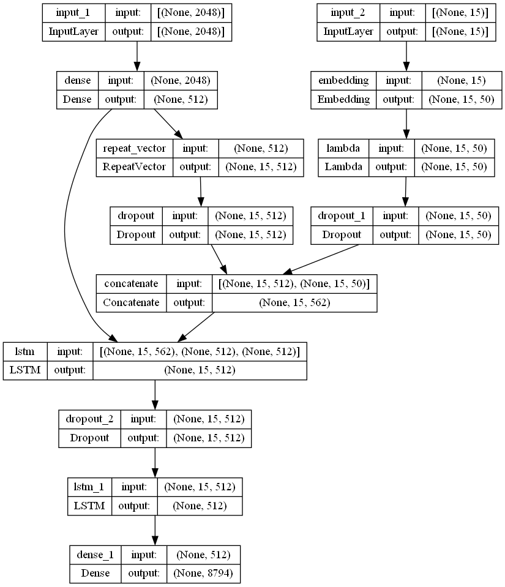
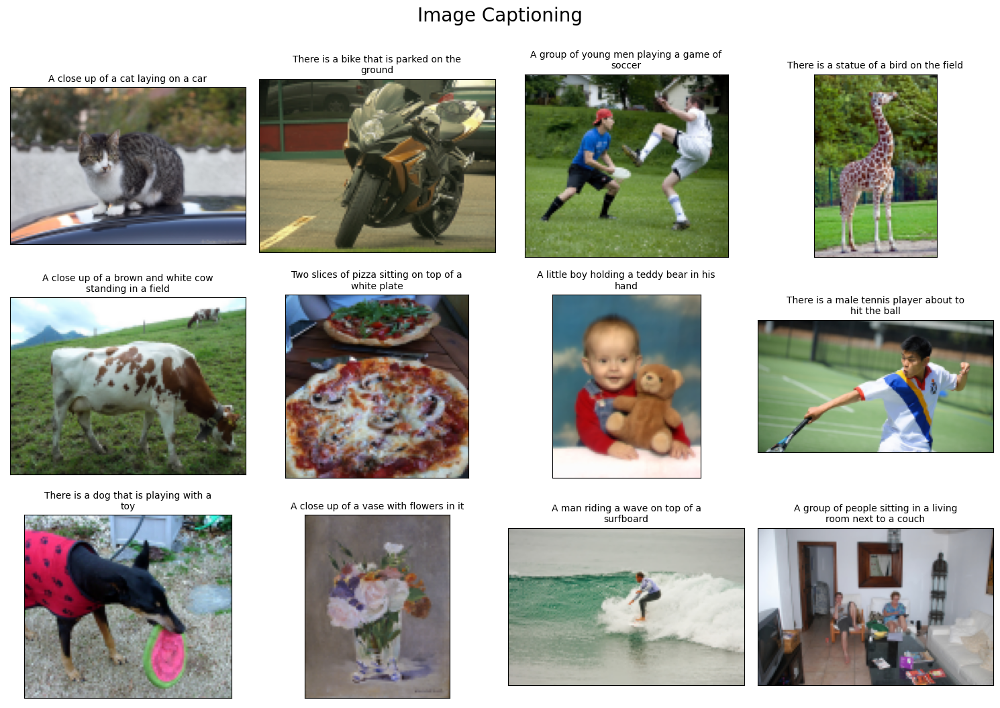

# Image Captioning
## Model using Inception Net V3, LSTM and Glove (Using SSD300 to improve feature)



## How to run?
### Install lib
```
pip install -r requirements.txt
```

### Download data
```console
python data_download.py
```
> **Note** : Dataset is MS COCO 2014 and Glove <Wikipedia 2014 + Gigaword 5>. This is large dataset, long download.
### Preprocess
You **must** run
```console
python preprocess.py
```
With COCO datase this command runs for a long time you can download and coppy them to `ROOT / process_data`

### [Download here](https://drive.google.com/drive/folders/1HDgToaiFKzVNTQZI1ts2Dlfgh1sVMk3D?usp=sharing)

### Trainning
```console
python train.py --batch-size 64 --output weights --epochs 30
```
You can download pre-train model an copy them to `ROOT / weights`
### [Download here](https://drive.google.com/drive/folders/1oXVC8fVioblaRpvB-tVtQsBHwKTmfMse?usp=sharing)

### Predict
```console
python predict.py --image path/to/image --weight path/to/weight --k-beam 9
```

## Result

You can see sumary in [summary.ipynb](summary.ipynb)